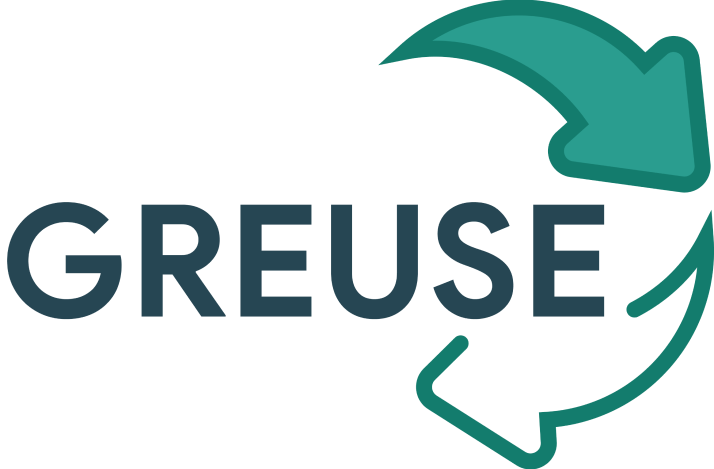

Greuse app is built on a waste overload situation that leads to environmental, allows user to exchange things they no longer use with belongings of another user and receive Greuse points for attractive gifts.

This project is written in Dart-Flutter.

<b>Requirements:</b>

<ul>
    <li>Flutter SDK</li>
    <li>Firebase google-services.json</li>
    <li>Android app bluid.gradle: applicationId "vn.edu.uit.greuse"</li>
</ul>

<b>📷ScreenShots:</b>

<table>
<tr>
<td>
    
</td>
<td>
    
</td>
</tr>
<tr>
    <td>
        
    </td>
    <td>
         
    </td>
</tr>
</table>

 

<b>Youtube video:</b> <a href='https://www.youtube.com/watch?v=v9kt_1lCFSo'>Here</a>

 

<b>😉Members:</b>

<ul>
    <li><a href='https://github.com/TrungHieu-HCMUIT'>Võ Đức Trung Hiếu</a></li>
    <li><a href='https://github.com/khiemledev'>Lê Trần Trọng Khiêm</a></li>
    <li><a href='https://github.com/fantashi099'>Trần Minh Tiến</a></li>
    <li><a href='https://github.com/hoangharu2002'>Nguyễn Nhật Hoàng</a></li>
</ul>